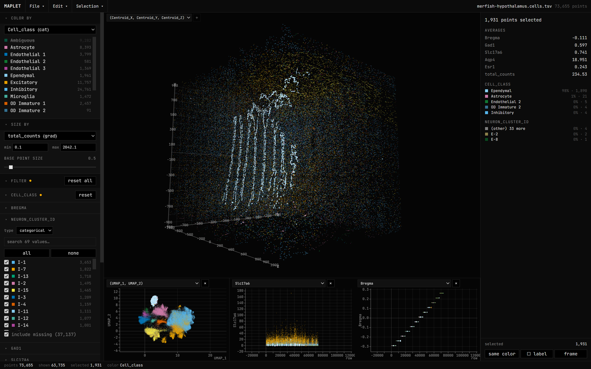

# Maplet - a local, web-based viewer for spatial single-cell and single-molecule datasets

A standalone desktop web app for **interactively viewing spatial sequencing and analysis results in 3D** - location, outline, cell-type calls, spatial barcodes, methylation, and more - load from plain **CSV / TSV spreadsheet** (wide format, one row per cell/data point). Runs as a plain webpage in any browser.

## Core features

- **One-click run** - Run `MapletViewer.html`, load your dataset (or the sample dataset at `sample-data/merfish-hypothalamus.cells.tsv`), confirm variable assignment, play.
- **Assign xyz on load** - A dialog lists every column with example values and a proposed role (guessed from names + values); you confirm or change each - id, a coordinate axis of **map 0** (the main viewer) or maps **1–3** (linked auxiliary viewers for a UMAP or a second assay), or a **numerical** / **categorical** variable.
- **Color, resize, and filter by any variable** - Color by **numeric gradience** (perceptual colormap + colorbar, linear or log) or **categorical palette** with legend. Resize by **gated numeric values** with base size and min/max cut-off values. Filter by **min/max range** for numerical variables, and **search, select, and exclude** by categorical ones. Filtered-out cells can ghost or hide completely, while the "shown" count updates live with adjustments.
- **Select & inspect** - Click a cell/data point to see its variable values; hover shows a basic tag near the cursor (ID + type); you can also select multiple cells **by the same color** - or enable **lasso tool** by holding shift key - and view the summary details of the selected group.
- **Linked auxiliary viewers** - Assign auxiliary x, y, and z coordinates from variables and view cells/data points from multiple coordinate planes (spatial, UMAP, etc.).
- **View only, no modification** - Original dataset will not be edited or coerced, progress/visualizations saved separately as views (.yml) or bundled data (.json).
- **Image overlay** - (Experimental) Add image overlays using a coordinate and file reference table.
- **View & export** - (Experimental) Snap the camera to the XY / XZ / YZ plane, fit to all or only-visible cells, frame the selection, or toggle **orthographic projection**. Export the current view as a **PNG** (raster, chosen size + background), a publication-ready vector **SVG**, or save as a reproducible `.maplet.json` preset with original dataset and added visual modifications bundled.
- **Save and load your changes** - Save file records filters, colors, selection, everything.
- **Everything is undoable** - Color, filter, selection, view - go to edit history and **click a past command to revert** to that exact state, or simply **Ctrl+Z / Ctrl+Shift+Z** (or Ctrl+Y) to undo or redo.

## Datasets

The viewer draws smoothly up to **250,000 cells**. For files with greater dimension, you can choose to load the first 250,000 entries or load anyway (high demand for memory capacity and computation power).

**Demo dataset.** [`sample-data/merfish-hypothalamus.cells.tsv`](sample-data/merfish-hypothalamus.cells.tsv) is a derived **MERFISH mouse-hypothalamus** dataset (Moffitt et al., 2018) with 73,655 cells across 12 serial sections stacked into a 3-D volume (Centroid_X/Y/Z), each with a linked **UMAP** embedding (UMAP_1/UMAP_2), 16 cell classes, 70 neuron clusters, and marker-gene + transcript gradients.

> **Data attribution.** Moffitt et al., *Science* 2018, [doi:10.1126/science.aau5324](https://doi.org/10.1126/science.aau5324). Source data on Dryad ([doi:10.5061/dryad.8t8s248](https://doi.org/10.5061/dryad.8t8s248)), released under **CC0 1.0**.
